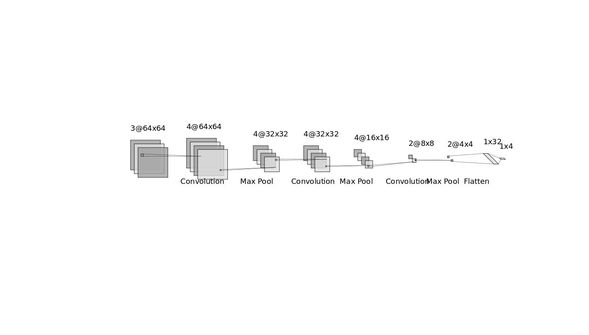

# Intro

- Data overlook. We saw some peaks in the data moving with us while moving.
- Came up with ideas for supervised/unsupervised aproaches (not everything was successful, we'll guide you through it).

# Unsupervised

Firstly [preprocessing](https://github.com/ml-lohi/hackathon-milan/blob/master/submission/code/data_preprocessing.ipynb) to detect peaks
- gaussian blurring.  **Result:** nothing good, peaks come together
- open morphology to reduce some noise. **Result:** was not so neccessary, as there was not a lot of noise; further models proved it.
- (A little more complex) Thought about sliding in the histogram and finding peaks on range of the velocity by every point of range. Preveiously the second derivative of gaussian was applied, to emphasise peaks. **Result:** didn't show any distinguishing features between data over 0,1,2,3 people.
- Sailency map.
# Supervised

### First approach was wo create a CNN

#### Data construction:

Each datapoint has a following shape (10,3,64,64), it means that every datapoint corresponds to 500ms measurement approximately, with 10 frames, 3 radars and a doppler(blabla) image of the shape 64x64.

We reshaped the data as following: summed over 5 frames with normailsation to reduce amount of input points over 500ms to 1, reshaped the image to 64x64x3. In this way we obtain the shape of a normal picture with RGB corresponding to values of the 3 radars.

We measured for 3 Minutes each state (0,1,2,3 peaople). Further we reduced our data only to th moving objects and ignored the static line in the middle, as it is not representative for the task.

We took 10% of this data for test and set validation split in the model to futher 10%. The reason for a rather smaller test/validation set is beacuse of the small amount of data.

#### CNN Architecture

The code to CNN can be found [here]().

The amount of data doesn't give us a lot of freedom that's why amount of paramenters is rather smaller than it is **usually the case**.

### LSTM&CNN

#### Data construction

Data construction is very similar but in this case we take 20 frames instead of 10 as we want to collect more data in some period to feed our NN with it. We used different RNNs (i.e. GRU) but the best was the LSTM. 

#### LSTM Architecture

We constructed the CNN architecture and fed the data in it, without summing over the frames, because we need time coordinate. CNN layers are fed into the extra TimeDistributed layers which take care of the time domain. Afterwards we flatten the data and feed it into the LSTM wit 10 units, finishing with dropout and dense layer to the 4 classes.

# The app

You need all the libraries, provided in the [requirements.txt](https://github.com/ml-lohi/hackathon-milan/blob/master/requirements.txt).

There are 2 apps that you can start directly by plugging in the radar. 